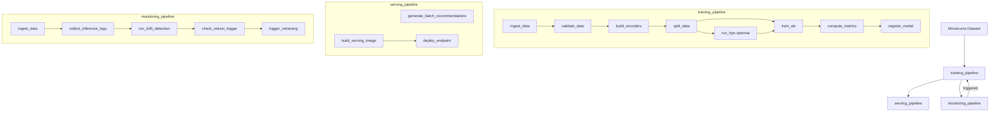

# Workflow Spec: Matrix Factorization

## Confirmed Decisions

| Decision | Choice | Rationale |
|---|---|---|
| **Algorithm** | **ALS** (not SVD) | Block-parallel by design; maps directly to Dask partitions; handles implicit feedback; guaranteed convergence |
| **ZenML Server** | Local compose stack (dev) and remote AWS stack (prod) | Shared metadata store + dashboard across environments |
| **Serving** | Both batch (S3 + optional DynamoDB) and real-time (FastAPI + local/SageMaker deploy) | Batch for pre-computation; real-time for low-latency fallback |
| **Dataset** | MovieLens 1M (local) / MovieLens 25M (AWS) | Controlled by `dataset_size` pipeline parameter |
| **Monitoring** | Evidently AI | Purpose-built ML monitoring with ZenML-compatible workflow |
| **Experiment tracking** | MLflow | Mature tracker with ZenML integration |
| **Checkpointing** | Epoch-level `.npy` + `.done` marker files | Resumable training with atomic checkpoint commits |

---

## Architecture Overview

---

## Source Layout (Current)

- `workflows/matrix_factorization/configs/{local,aws}.yaml`
- `workflows/matrix_factorization/materializers/{als_recommender_materializer,dask_dataframe_materializer}.py`
- `workflows/matrix_factorization/models/als_recommender.py`
- `workflows/matrix_factorization/pipelines/{training,serving,monitoring}_pipeline.py`
- `workflows/matrix_factorization/steps/`
  - `data_ingestion/ingest.py`
  - `data_validation/validate.py`
  - `feature_engineering/{encoders,split}.py`
  - `hpo/run_hpo.py`
  - `training/train.py` (`train_als`)
  - `model_evaluation/{evaluate,register}.py`
  - `serving/{batch_predict,build_image,deploy}.py`
- `workflows/matrix_factorization/serving/app.py`
- `workflows/matrix_factorization/utils/als_numba.py`
- shared helpers: `helpers/{checkpointing,dask_cluster}.py`
- shared monitoring steps: `steps/monitoring/{collect_logs,drift_detection,retrain,trigger}.py`

---

## Pipeline Definitions

### Training pipeline (`training_pipeline`)

Order:
1. `ingest_data`
2. `validate_data`
3. `build_encoders`
4. `split_data`
5. `run_hpo` (optional via `enable_hpo`)
6. `train_als`
7. `compute_metrics`
8. `register_model`

Bound ZenML model: `als_movie_recommender`.

### Serving pipeline (`serving_pipeline`)

Runs two serving subflows:
- Batch: `generate_batch_recommendations`
- Real-time: `build_serving_image` -> `deploy_endpoint`

### Monitoring pipeline (`monitoring_pipeline`)

Order:
1. `ingest_data` (reference data refresh)
2. `collect_inference_logs`
3. `run_drift_detection`
4. `check_retrain_trigger`
5. `trigger_retraining`

Retrain target:
- module: `workflows.matrix_factorization.pipelines.training_pipeline`
- function: `training_pipeline`

---

## Configuration Contract

### `configs/local.yaml`

Core values:
- `dataset_size: "1m"`
- `enable_hpo: false`
- `optuna_storage: "sqlite:///optuna.db"`
- `checkpoint_path: "./checkpoints"`
- `settings.docker.dockerfile: "docker/pipeline/Dockerfile"`

### `configs/aws.yaml`

Core values:
- `dataset_size: "25m"`
- `enable_hpo: true`
- `optuna_storage: "${OPTUNA_STORAGE}"`
- `checkpoint_path: "s3://aips-zenml-checkpoints"`
- `batch_output_path: "s3://aips-zenml-predictions/batch"`
- `monitoring_output_path: "s3://aips-zenml-predictions/monitoring"`
- `settings.docker.dockerfile: "docker/pipeline/Dockerfile"`

---

## Serving API Contract (`serving/app.py`)

Endpoints:
- `GET /health` -> `{status, model_version, n_users, n_items, rank, cpu_percent, memory_percent, disk_percent}`
- `POST /recommend` with `{user_id, top_k}` -> `{user_id, recommendations, model_version, latency_ms}`

Behavior:
- Loads model from `MODEL_PATH` on startup.
- Writes inference logs to `LOG_PATH` when `LOG_ENABLED=true`.
- Returns 404 for unknown users.

---

## AWS Stack Components (from `infra/aws/setup_stacks.sh`)

| Component | Name |
|---|---|
| Service Connector | `aws_connector` |
| Artifact Store | `s3_store` |
| Container Registry | `ecr_registry` |
| Orchestrator | `sagemaker_orch` |
| Experiment Tracker | `mlflow_tracker` |
| Data Validator | `evidently_data_validator` |
| Stack | `aws_stack` |

---

## Notes

- `run.py` auto-discovers workflows and pipelines; no manual pipeline registry edits required.
- Training resumability depends on `.done` marker ordering in `helpers/checkpointing.py`.
- Monitoring steps are global under `steps/monitoring/` and imported by workflow pipelines.
