# Workflow Spec: Matrix Factorization

## Confirmed Decisions

| Decision | Choice | Rationale |
|---|---|---|
| **Algorithm** | **ALS** (not SVD) | Block-parallel by design with process-level partition execution; handles implicit feedback; guaranteed convergence |
| **ZenML Server** | Local compose stack (dev) and remote AWS stack (prod) | Shared metadata store + dashboard across environments |
| **Serving** | Both batch (S3 + optional DynamoDB) and real-time (FastAPI + local/SageMaker deploy) | Batch for pre-computation; real-time for low-latency fallback |
| **Dataset** | MovieLens 1M (local) / MovieLens 25M (AWS) | Controlled by `dataset_size` pipeline parameter |
| **Monitoring** | Evidently AI | Purpose-built ML monitoring with ZenML-compatible workflow |
| **Experiment tracking** | MLflow | Mature tracker with ZenML integration |
| **Checkpointing** | Epoch-level `.npy` + `.done` marker files | Resumable training with atomic checkpoint commits |

---

## Architecture Overview

```mermaid
graph TD
    A[MovieLens Dataset] --> T[training_pipeline]
    A --> D[data_pipeline]
    D --> T
    T --> S[serving_pipeline]
    T --> M[monitoring_pipeline]
    M -->|triggered| T

    subgraph data_pipeline
        D1[ingest_data] --> D2[validate_data] --> D3[build_encoders] --> D4[create_features_artifact]
    end

    subgraph training_pipeline
        T0[load_features_artifact] --> T4[split_data]
        T1[ingest_data] --> T4
        T4 --> T5[run_hpo_trial xN optional]
        T5 --> T6[collect_best_hpo_params]
        T4 --> T7[load_or_init_training_factors]
        T6 --> T7
        T7 --> T8[train_als_epoch xN] --> T9[save_training_checkpoint xN]
        T9 --> T10[compute_metrics] --> T11[register_model] --> T12[cleanup_pipeline_checkpoints]
    end

    subgraph serving_pipeline
        S1[load_als_model] --> S2[predict_user_batch xN] --> S3[collect_batch_recommendations]
        S4[build_serving_image] --> S5[deploy_endpoint]
    end

    subgraph monitoring_pipeline
        M1[ingest_data] --> M2[collect_inference_logs] --> M3[run_drift_detection] --> M4[check_retrain_trigger] --> M5[trigger_retraining]
    end
```

---

## Source Layout (Current)

- `workflows/matrix_factorization/configs/local/{data_pipeline,training_pipeline,serving_pipeline,monitoring_pipeline}.yaml`
- `workflows/matrix_factorization/configs/aws/{data_pipeline,training_pipeline,serving_pipeline,monitoring_pipeline}.yaml`
- `workflows/matrix_factorization/materializers/als_recommender_materializer.py`
- `workflows/matrix_factorization/models/als_recommender.py`
- `workflows/matrix_factorization/pipelines/{data,training,serving,monitoring}_pipeline.py`
- `workflows/matrix_factorization/steps/`
  - `data_ingestion/ingest.py`
  - `data_validation/validate.py`
    - `feature_engineering/{encoders,features_artifact,split}.py`
  - `hpo/run_hpo.py` (`run_hpo_trial`, `collect_best_hpo_params`)
  - `training/als_epoch.py` (`train_als_epoch`)
  - `training/checkopoint.py` (`load_or_init_training_factors`, `save_training_checkpoint`, `load_hpo_checkpoints`, `save_hpo_trial_checkpoint`, `cleanup_pipeline_checkpoints`)
  - `model_evaluation/{evaluate,register}.py`
  - `serving/{batch_predict,batch_predict_user}.py`
- `workflows/matrix_factorization/serving/app.py`
- `workflows/matrix_factorization/utils/als_numba.py`
- shared helpers: `helpers/checkpointing.py`
- shared monitoring steps: `steps/monitoring/{collect_logs,drift_detection,retrain,trigger}.py`
- shared serving steps: `steps/serving/{build_image,deploy}.py`

---

## Pipeline Definitions

### Training pipeline (`training_pipeline`)

Order:
1. `load_features_artifact`
2. `ingest_data`
3. `split_data`
5. `load_hpo_checkpoints` (optional via `enable_hpo`)
6. `run_hpo_trial` (fan-out, optional via `enable_hpo`)
7. `save_hpo_trial_checkpoint` (fan-out, optional via `enable_hpo`)
8. `collect_best_hpo_params` (fan-in, optional via `enable_hpo`)
9. `load_or_init_training_factors`
10. `train_als_epoch` + `save_training_checkpoint` (chained for `n_iter` epochs)
11. `compute_metrics`
12. `register_model`
13. `cleanup_pipeline_checkpoints`

### Data pipeline (`data_pipeline`)

Order:
1. `ingest_data`
2. `validate_data`
3. `build_encoders`
4. `create_features_artifact`

Bound ZenML model: `als_movie_recommender`.

### Serving pipeline (`serving_pipeline`)

Runs two serving subflows:
- Batch: `load_als_model` -> `predict_user_batch` (fan-out) -> `collect_batch_recommendations` (fan-in)
- Real-time: `build_serving_image` -> `deploy_endpoint`

### Monitoring pipeline (`monitoring_pipeline`)

Order:
1. `ingest_data` (reference data refresh)
2. `collect_inference_logs`
3. `run_drift_detection`
4. `check_retrain_trigger`
5. `trigger_retraining`

Retrain target:
- module: `workflows.matrix_factorization.pipelines.training_pipeline`
- function: `training_pipeline`

---

## Configuration Contract

### `configs/local/training_pipeline.yaml`

Core values:
- `dataset_size: "1m"`
- `enable_hpo: true`
- `optuna_storage: "${OPTUNA_STORAGE_URI}"`
- `checkpoint_path: "s3://${ZENML_CHECKPOINT_BUCKET}"`
- `settings.docker.dockerfile: "docker/pipeline/Dockerfile"`

### `configs/local/data_pipeline.yaml`

Core values:
- `dataset_size: "1m"`
- validation thresholds for sparse ratings data
- `create_features_artifact` persists encoder artifact

### `configs/local/serving_pipeline.yaml`

Core values:
- `deploy_mode: "local"`
- `batch_output_path: "s3://${ZENML_PREDICTIONS_BUCKET}/batch"`
- `n_batches: 1`

### `configs/local/monitoring_pipeline.yaml`

Core values:
- `logs_path: "s3://${ZENML_PREDICTIONS_BUCKET}/logs"`
- `monitoring_output_path: "s3://${ZENML_PREDICTIONS_BUCKET}/monitoring"`
- `retrain_config_path: "workflows/matrix_factorization/configs/local/training_pipeline.yaml"`

### `configs/aws/training_pipeline.yaml`

Core values:
- `dataset_size: "25m"`
- `enable_hpo: true`
- `optuna_storage: "${OPTUNA_STORAGE_URI}"`
- `checkpoint_path: "s3://zenml-checkpoints"`

### `configs/aws/data_pipeline.yaml`

Core values:
- `dataset_size: "25m"`
- validation thresholds for sparse ratings data
- `create_features_artifact` persists encoder artifact

### `configs/aws/serving_pipeline.yaml`

Core values:
- `batch_output_path: "s3://zenml-predictions/batch"`
- `deploy_mode: "sagemaker"`

### `configs/aws/monitoring_pipeline.yaml`

Core values:
- `monitoring_output_path: "s3://zenml-predictions/monitoring"`
- `retrain_config_path: "workflows/matrix_factorization/configs/aws/training_pipeline.yaml"`
- `settings.docker.dockerfile: "docker/pipeline/Dockerfile"`

---

## Serving API Contract (`serving/app.py`)

Endpoints:
- `GET /health` -> `{status, app_version, model_version, n_users, n_items, rank, cpu_percent, memory_percent, disk_percent}`
- `POST /recommend` with `{user_id, top_k}` -> `{user_id, recommendations, model_version, latency_ms}`

Behavior:
- Loads model from `MODEL_PATH` on startup.
- Writes inference logs to `MODEL_DATA_CAPTURE_PATH` when `MODEL_DATA_CAPTURE_ENABLED=true`.
- Returns 404 for unknown users.

---

## AWS Stack Components (from `infra/aws/setup_stacks.sh`)

| Component | Name |
|---|---|
| Service Connector | `aws_connector` |
| Artifact Store | `s3_store` |
| Container Registry | `ecr_registry` |
| Orchestrator | `sagemaker_orchestrator` |
| Step Operator | `sagemaker_step_operator` |
| Experiment Tracker | `mlflow_tracker` |
| Data Validator | `evidently_data_validator` |
| Stack | `aws_stack` |

---

## Notes

- `run.py` auto-discovers workflows and pipelines; no manual pipeline registry edits required.
- Training resumability depends on `.done` marker ordering in `helpers/checkpointing.py`.
- Monitoring steps are global under `steps/monitoring/` and imported by workflow pipelines.
