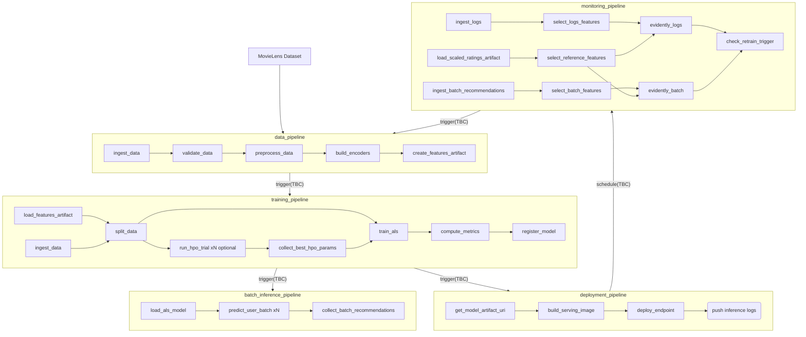

# Workflow Spec: Matrix Factorization

## Confirmed Decisions

| Decision                | Choice                                                                               | Rationale                                                                                                          |
| ----------------------- | ------------------------------------------------------------------------------------ | ------------------------------------------------------------------------------------------------------------------ |
| **Algorithm**           | **ALS** (not SVD)                                                                    | Block-parallel by design with process-level partition execution; handles implicit feedback; guaranteed convergence |
| **ZenML Server**        | Local compose stack (dev) and remote AWS stack (prod)                                | Shared metadata store + dashboard across environments                                                              |
| **Serving**             | Both batch (S3 + optional DynamoDB) and real-time (FastAPI + local/SageMaker deploy) | Batch for pre-computation; real-time for low-latency fallback                                                      |
| **Dataset**             | MovieLens 1M (local) / MovieLens 25M (AWS)                                           | Controlled by `dataset_size` pipeline parameter                                                                    |
| **Monitoring**          | Evidently AI                                                                         | Purpose-built ML monitoring with ZenML-compatible workflow                                                         |
| **Experiment tracking** | ZenML native (log_metadata)                                                          | Built-in metadata logging without external dependency                                                              |
| **Checkpointing**       | Epoch-level `.npy` + `.done` marker files                                            | Resumable training with atomic checkpoint commits                                                                  |

---

## Architecture Overview

_TBC: Means "to be confirmed" — the exact trigger/scheduling mechanism is not yet finalized due to the limitations in the community version of Zenml, but the intent is to have a fully automated workflow._

---

## Source Layout (Current)

- `workflows/matrix_factorization/configs/local/{data_pipeline,training_pipeline,batch_inference_pipeline,deployment_pipeline,monitoring_pipeline}.yaml`
- `workflows/matrix_factorization/configs/aws/{data_pipeline,training_pipeline,batch_inference_pipeline,deployment_pipeline,monitoring_pipeline}.yaml`
- `workflows/matrix_factorization/materializers/als_recommender_materializer.py`
- `workflows/matrix_factorization/models/{als_implicit_recommender,base_recommender,numba}.py`
- `workflows/matrix_factorization/pipelines/{data,training,batch_inference,deployment,monitoring}_pipeline.py`
- `workflows/matrix_factorization/steps/`
  - `data/ingest.py`, `data/validate.py`, `data/preprocess.py`
  - `features/{encoders,artifacts,select,split}.py`
  - `hpo/run_hpo.py` (`run_hpo_trial`, `collect_best_hpo_params`)
  - `training/train_als.py` (`train_als` — full training loop with inline checkpoint resume)
  - `evaluation/{evaluate,register}.py`
  - `prediction/{batch_predict,batch_predict_user}.py`
- `workflows/matrix_factorization/serving/app.py`
- shared helpers: `helpers/checkpointing.py`
- shared monitoring steps: `steps/monitoring/retrain.py`
- shared serving steps: `steps/serving/{build_image,deploy_model,model_artifacts,trigger}.py`

---

## Pipeline Definitions

### Training pipeline (`training_pipeline`)

Order:

1. `load_features_artifact`
2. `ingest_data`
3. `split_data`
4. `run_hpo_trial` (fan-out, optional via `enable_hpo`)
5. `collect_best_hpo_params` (fan-in, optional via `enable_hpo`)
6. `train_als` (full training loop with inline checkpoint resume; auto-resumes from latest `.done` epoch)
7. `compute_metrics`
8. `register_model`

### Data pipeline (`data_pipeline`)

Order:

1. `ingest_data`
2. `validate_data`
3. `preprocess_data` (dedup, user/item activity filter, top-N per user)
4. `build_encoders`
5. `create_features_artifact`

Bound ZenML model: `als_movie_recommender`.

### Batch inference pipeline (`batch_inference_pipeline`)

Runs batch scoring fan-out/fan-in:

- `load_als_model` → `predict_user_batch` × n_batches (fan-out) → `collect_batch_recommendations` (fan-in)

Outputs to S3 parquet and optionally DynamoDB.

### Deployment pipeline (`deployment_pipeline`)

Builds and deploys the real-time serving endpoint:

- `get_model_artifact_uri` → `build_serving_image` → `deploy_endpoint`

### Monitoring pipeline (`monitoring_pipeline`)

Order:

1. `load_scaled_ratings_artifact` → `select_reference_features` (shared reference dataset)
2. Flow 1 — Inference logs: `ingest_logs` → `select_logs_features` → `evidently_report_step` (id=`evidently_logs`)
3. Flow 2 — Batch recommendations: `ingest_batch_recommendations` → `select_batch_features` → `evidently_report_step` (id=`evidently_batch`)
4. `check_retrain_trigger` (fan-in — evaluates both Evidently reports)

Retrain target:

- module: `workflows.matrix_factorization.pipelines.training_pipeline`
- function: `training_pipeline`

---

## Configuration Contract

### `configs/local/training_pipeline.yaml`

Core values:

- `dataset_size: "1m"`
- `enable_hpo: true`
- `optuna_storage: "${OPTUNA_STORAGE_URI}"`
- `checkpoint_path: "s3://${ZENML_CHECKPOINT_BUCKET}"`
- `settings.docker.dockerfile: "docker/pipeline/Dockerfile"`

### `configs/local/data_pipeline.yaml`

Core values:

- `dataset_size: "1m"`
- validation thresholds for sparse ratings data
- `create_features_artifact` persists encoder artifact

### `configs/local/batch_inference_pipeline.yaml`

Core values:

- `n_batches: 3`
- `model_stage: "staging"`
- `batch_output_path: "s3://${ZENML_PREDICTIONS_BUCKET}/batch"`

### `configs/local/deployment_pipeline.yaml`

Core values:

- `deploy_mode: "local"`
- `endpoint_name: "als-movie-recommender"`

### `configs/local/monitoring_pipeline.yaml`

Core values:

- `logs_path: "s3://${ZENML_PREDICTIONS_BUCKET}/logs"`
- `monitoring_output_path: "s3://${ZENML_PREDICTIONS_BUCKET}/monitoring"`
- `retrain_config_path: "workflows/matrix_factorization/configs/local/training_pipeline.yaml"`

### `configs/aws/training_pipeline.yaml`

Core values:

- `dataset_size: "25m"`
- `enable_hpo: true`
- `optuna_storage: "${OPTUNA_STORAGE_URI}"`
- `checkpoint_path: "s3://zenml-checkpoints"`

### `configs/aws/data_pipeline.yaml`

Core values:

- `dataset_size: "25m"`
- validation thresholds for sparse ratings data
- `create_features_artifact` persists encoder artifact

### `configs/aws/batch_inference_pipeline.yaml`

Core values:

- `n_batches: 17`
- `batch_output_path: "s3://zenml-predictions/batch"`
- `dynamodb_table: "${ZENML_BATCH_DDB_TABLE_NAME}"`

### `configs/aws/deployment_pipeline.yaml`

Core values:

- `deploy_mode: "sagemaker"`
- `instance_type: "ml.t2.medium"`

### `configs/aws/monitoring_pipeline.yaml`

Core values:

- `monitoring_output_path: "s3://zenml-predictions/monitoring"`
- `retrain_config_path: "workflows/matrix_factorization/configs/aws/training_pipeline.yaml"`
- `settings.docker.dockerfile: "docker/pipeline/Dockerfile"`

---

## Serving API Contract (`serving/app.py`)

Endpoints:

- `GET /health` -> `{status, app_version, model_version, n_users, n_items, rank, cpu_percent, memory_percent, disk_percent}`
- `POST /predict` with `{user_id, top_k}` -> `{user_id, predictions, model_version, latency_ms}`

Behavior:

- Loads model from `MODEL_PATH` on startup.
- Writes inference logs to `MODEL_INFERENCE_LOG_PATH` when `MODEL_INFERENCE_LOG_ENABLED=true`.
- Returns 404 for unknown users.

---

## AWS Stack Components (from `infra/aws/setup_stacks.sh`)

| Component          | Name                       |
| ------------------ | -------------------------- |
| Service Connector  | `aws_connector`            |
| Artifact Store     | `s3_store`                 |
| Container Registry | `ecr_registry`             |
| Orchestrator       | `sagemaker_orchestrator`   |
| Step Operator      | `sagemaker_step_operator`  |
| Data Validator     | `evidently_data_validator` |
| Stack              | `aws_stack`                |

---

## Notes

- `run.py` auto-discovers workflows and pipelines; no manual pipeline registry edits required.
- Training resumability depends on `.done` marker ordering in `helpers/checkpointing.py`.
- Monitoring steps are global under `steps/monitoring/` and imported by workflow pipelines.
