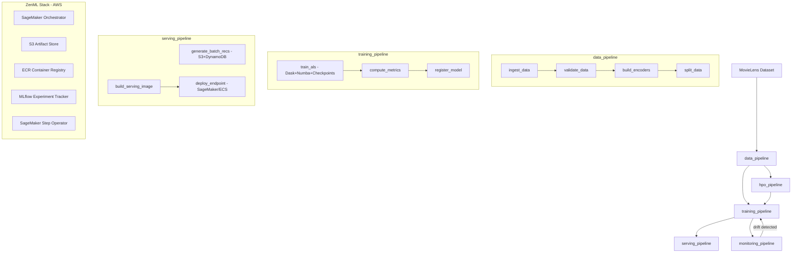

# ZenML MLOps Orchestration Platform — Implementation Specs

## TL;DR

Build a unified MLOps repository on AWS using ZenML as the orchestration backbone, with a Matrix Factorization (ALS) pipeline for movie recommendations as the reference implementation. The pipeline covers:

**data ingestion → feature engineering → distributed ALS training (Dask + Numba) → HPO (Optuna) → batch + real-time serving → Evidently drift monitoring → auto-retraining**

All stages live under a self-contained `pipelines/matrix_factorization/` directory and can be cloned as a template for future ML workflows.

---

## Confirmed Decisions

| Decision | Choice | Rationale |
|---|---|---|
| **Algorithm** | **ALS** (not SVD) | Block-parallel by design; maps directly to Dask partitions; handles implicit feedback; guaranteed convergence |
| **ZenML Server** | Remote on AWS (EC2 + RDS/PostgreSQL) | Shared metadata store + dashboard for the team |
| **Serving** | Both batch (S3 + DynamoDB) + real-time (FastAPI + SageMaker) | Batch for offline pre-computation; real-time for low-latency fallback |
| **Dataset** | MovieLens 1M (local dev) / MovieLens 25M (AWS) | Controlled by `dataset_size` config param |
| **Monitoring** | Evidently AI | Purpose-built ML monitoring with good ZenML integration |
| **Experiment tracking** | MLflow (self-hosted on AWS EC2) | Mature, ZenML native integration |
| **Checkpointing** | Epoch-level `.npy` + `.done` marker files | Coarse enough to avoid ZenML overhead; fine enough to resume after any epoch failure |

---

## Architecture Overview



---

## Directory Structure

```
aips-recs-zenml-mlops-poc/
├── .zen/                                 # zenml init artifact (auto-created)
├── .agents/skills/
│   ├── create-pipeline/SKILL.md          # NEW: scaffold skill for new pipelines
│   └── ...existing skills...
├── .github/workflows/ci.yml             # lint → test → Docker build → ECR push
│
├── configs/
│   ├── local.yaml                        # local dev config (1M dataset, SQLite HPO)
│   └── aws.yaml                          # AWS production config (25M dataset, PG HPO)
│
├── infra/aws/
│   ├── setup_stacks.sh                   # idempotent ZenML stack registration script
│   ├── iam_policy.json                   # least-privilege IAM policy
│   └── mlflow/docker-compose.yml         # MLflow server (PostgreSQL + S3 backend)
│
├── materializers/
│   ├── __init__.py
│   ├── dask_dataframe_materializer.py    # Dask DataFrame ↔ Parquet
│   └── als_recommender_materializer.py   # ALSRecommender ↔ cloudpickle
│
├── models/
│   ├── __init__.py
│   └── als_recommender.py                # ALSRecommender(user_factors, item_factors, encoders)
│
├── pipelines/matrix_factorization/
│   ├── __init__.py
│   ├── data_pipeline.py                  # ingest → validate → encode → split
│   ├── hpo_pipeline.py                   # Optuna distributed HPO (skippable)
│   ├── training_pipeline.py              # ALS train → evaluate → register
│   ├── serving_pipeline.py               # batch recs + real-time endpoint deploy
│   ├── monitoring_pipeline.py            # drift detection + retrain trigger
│   ├── config.yaml                       # pipeline-specific defaults (merged with configs/)
│   └── README.md
│
├── serving/
│   ├── app.py                            # FastAPI: GET /health, POST /recommend
│   └── Dockerfile
│
├── steps/
│   ├── data_ingestion/ingest.py
│   ├── data_validation/validate.py
│   ├── feature_engineering/
│   │   ├── encoders.py
│   │   └── split.py
│   ├── hpo/run_hpo.py
│   ├── als_training/train.py
│   ├── model_evaluation/
│   │   ├── evaluate.py
│   │   └── register.py
│   ├── serving/
│   │   ├── batch_predict.py
│   │   ├── build_image.py
│   │   └── deploy.py
│   └── monitoring/
│       ├── collect_logs.py
│       ├── drift_detection.py
│       ├── trigger.py
│       └── retrain.py
│
├── utils/
│   ├── __init__.py
│   ├── als_numba.py                      # @njit ALS solvers (primary perf-critical code)
│   ├── checkpointing.py                  # save/load epoch checkpoints to S3 or local
│   └── dask_cluster.py                   # get_dask_client() factory (local / ECS)
│
├── tests/
│   ├── unit/
│   │   ├── test_als_numba.py             # correctness vs. naive numpy
│   │   ├── test_checkpointing.py         # save/load roundtrip
│   │   ├── test_encoders.py              # encoder roundtrip
│   │   └── test_serving.py               # FastAPI /health + /recommend
│   └── integration/
│       └── test_data_pipeline.py         # full pipeline on tiny synthetic dataset
│
├── notebooks/exploration.ipynb
├── run.py                                # CLI entrypoint: --pipeline --config --stack
├── pyproject.toml                        # all pinned dependencies
├── Makefile
├── Dockerfile                            # base image for all pipeline steps
├── .dockerignore
├── .gitignore
├── AGENTS.md
└── README.md
```

---

## Phase 0: Repository Scaffold & Developer Tooling

**Goal**: Working local dev environment, ZenML initialized, CI/CD pipeline defined.

### Tasks
- [ ] `pyproject.toml` — all pinned dependencies (zenml, dask, optuna, numba, implicit, evidently, fastapi, mlflow, boto3, s3fs, pyarrow)
- [ ] `.python-version` — `3.12`
- [ ] `run.py` — CLI entrypoint (`--pipeline`, `--config`, `--stack` args)
- [ ] `Makefile` — targets: `setup`, `run-local`, `run-aws`, `lint`, `test`, `docker-build`
- [ ] `Dockerfile` — base image for pipeline steps
- [ ] `.dockerignore` — excludes `.venv`, `data/`, `.git`, `notebooks/`, `*.db`
- [ ] `.gitignore`
- [ ] `configs/local.yaml` — `dataset_size: 1m`, `n_dask_partitions: 4`, `optuna_storage: sqlite:///optuna.db`
- [ ] `configs/aws.yaml` — `dataset_size: 25m`, `n_dask_partitions: 64`, `optuna_storage: postgresql://...`
- [ ] `.github/workflows/ci.yml` — lint → unit tests → Docker build → ECR push on merge to `main`
- [ ] Run `zenml init` to create `.zen/` source root

---

## Phase 1: AWS Infrastructure Provisioning

**Goal**: All AWS resources and ZenML stacks provisioned and registered.

### Resources (all in `us-east-1` unless overridden)
| Resource | Name | Purpose |
|---|---|---|
| S3 bucket | `aips-zenml-artifacts` | ZenML artifact store |
| S3 bucket | `aips-zenml-checkpoints` | ALS epoch checkpoints |
| S3 bucket | `aips-zenml-data` | Raw + processed datasets |
| S3 bucket | `aips-zenml-predictions` | Batch recommendation outputs |
| ECR repo | `aips-zenml` | Pipeline Docker images |
| IAM role | `zenml-execution-role` | Least-privilege execution role |
| EC2 (t3.medium) | `zenml-server` | ZenML server + RDS PostgreSQL |
| EC2 (t3.small) | `mlflow-server` | MLflow tracking server |

### ZenML Stack Components
| Component | Name | Flavor | Details |
|---|---|---|---|
| Artifact store | `s3_store` | `s3` | `s3://aips-zenml-artifacts/` |
| Container registry | `ecr_registry` | `aws` | `<ACCOUNT>.dkr.ecr.us-east-1.amazonaws.com` |
| Orchestrator | `sagemaker_orch` | `sagemaker` | SageMaker Pipelines |
| Experiment tracker | `mlflow_tracker` | `mlflow` | `http://<EC2-IP>:5000` |
| Step operator | `sagemaker_step_op` | `sagemaker` | `ml.c5.4xlarge` |

### ZenML Stacks
- `local_stack` — local orchestrator + local artifact store (dev only)
- `aws_stack` — SageMaker orch + S3 store + ECR + MLflow + SageMaker step operator

### Tasks
- [ ] `infra/aws/setup_stacks.sh` — idempotent registration of all components above
- [ ] `infra/aws/iam_policy.json` — least-privilege IAM policy
- [ ] `infra/aws/mlflow/docker-compose.yml` — MLflow with PG + S3
- [ ] `infra/aws/README.md` — provisioning runbook

---

## Phase 2: Data Pipeline

**Pipeline file**: `pipelines/matrix_factorization/data_pipeline.py`

```
ingest_data → validate_data → build_encoders → split_data
```

### Steps

#### `ingest_data` (`steps/data_ingestion/ingest.py`)
- Downloads MovieLens dataset based on `dataset_size` config param:
  - `1m` → `https://files.grouplens.org/datasets/movielens/ml-1m.zip`
  - `25m` → `https://files.grouplens.org/datasets/movielens/ml-25m.zip`
- Parses `ratings.dat` (1M) or `ratings.csv` (25M) into Dask DataFrame
- Writes Parquet files partitioned by `userId` range to artifact store
- Returns: `Annotated[dd.DataFrame, "raw_ratings"]` via `DaskDataFrameMaterializer`
- `enable_cache=True`

#### `validate_data` (`steps/data_validation/validate.py`)
- Assertions (raises `DataValidationError` on failure):
  - No null `userId`, `movieId`, `rating`
  - Ratings in [0.5, 5.0]
  - No duplicate `(userId, movieId)` pairs
  - Sparsity > 95%
- Returns: `Annotated[dict, "validation_report"]` with counts and statistics

#### `build_encoders` (`steps/feature_engineering/encoders.py`)
- Maps raw `userId` → dense int index [0, n_users-1]; same for `movieId`
- Returns: `Tuple[Annotated[pd.Series, "user_encoder"], Annotated[pd.Series, "item_encoder"]]`
- `enable_cache=True`

#### `split_data` (`steps/feature_engineering/split.py`)
- Stratified 80/10/10 train/val/test split by user (each user's ratings proportionally split)
- Applies encoders to produce integer-indexed `(user_idx, item_idx, rating)` DataFrames
- Returns: `Tuple[Annotated[dd.DataFrame, "train_data"], Annotated[dd.DataFrame, "val_data"], Annotated[dd.DataFrame, "test_data"]]`
- `enable_cache=True`

### Custom Materializer
`materializers/dask_dataframe_materializer.py` — `DaskDataFrameMaterializer(BaseMaterializer)`:
- `save(df)` → `dask.dataframe.to_parquet(path)`
- `load(data_type)` → `dask.dataframe.read_parquet(path)`

---

## Phase 3: HPO Pipeline

**Pipeline file**: `pipelines/matrix_factorization/hpo_pipeline.py`

Skipped entirely when `enable_hpo: false` in config; training uses default hyperparameters.

### Step: `run_hpo` (`steps/hpo/run_hpo.py`)

| Param | Value |
|---|---|
| `n_trials` | 200 |
| `pruner` | `HyperbandPruner(min_resource=1, max_resource=15)` |
| `sampler` | `TPESampler(constant_liar=True)` |
| `storage` | SQLite (local) / PostgreSQL (AWS) |
| `load_if_exists` | `True` — resumes from interrupted study |
| Training data | 20% subsample of training split |

**Search space**:
- `rank`: int [10, 200]
- `regularization`: float log-uniform [1e-3, 10.0]
- `alpha` (implicit confidence): float log-uniform [0.01, 10.0]
- `n_iter`: int [5, 25]

**Per-trial**:
1. Train ALS on subsample for `n_iter` epochs
2. Report per-epoch val RMSE via `trial.report(rmse, step=epoch)` + check `trial.should_prune()`
3. Return final val RMSE as objective

**Parallel execution**: Each trial submitted as a Dask future via `client.submit(study.optimize, objective, n_trials=1, pure=False)`

Returns: `Annotated[dict, "best_hyperparams"]`

---

## Phase 4: Training Pipeline

**Pipeline file**: `pipelines/matrix_factorization/training_pipeline.py`

```
train_als → compute_metrics → register_model
```

### Step: `train_als` (`steps/als_training/train.py`)

#### Checkpointing (resumability)

> **This is the critical resumability mechanism.** On any failure mid-training, the next run automatically resumes from the last completed epoch.

Checkpoint files written to `checkpoint_path` (configured per environment):
- Local: `./checkpoints/als_run_{run_id}/`
- AWS: `s3://aips-zenml-checkpoints/als_run_{run_id}/`

File pattern:
```
epoch_0001_users.npy      ← user factor matrix after epoch 1
epoch_0001_items.npy      ← item factor matrix after epoch 1
epoch_0001.done           ← atomic marker; only written after BOTH .npy files are saved
epoch_0002_users.npy
...
```

Resume logic (`utils/checkpointing.py`):
```python
start_epoch, user_factors, item_factors = load_latest_checkpoint(checkpoint_path)
# → finds latest .done marker, loads corresponding .npy files
# → if no checkpoints found, returns (0, None, None) to start fresh
```

#### ALS Training Loop

```python
for epoch in range(start_epoch, n_iter):
    # User factor update — parallel across Dask workers
    futures = [
        client.submit(solve_user_factors_numba, partition, item_factors, reg, rank)
        for partition in user_rating_partitions
    ]
    user_blocks = client.gather(futures)
    user_factors = np.vstack(user_blocks)

    # Item factor update — symmetric
    futures = [
        client.submit(solve_item_factors_numba, partition, user_factors, reg, rank)
        for partition in item_rating_partitions
    ]
    item_blocks = client.gather(futures)
    item_factors = np.vstack(item_blocks)

    # Checkpoint (every epoch)
    save_checkpoint(epoch + 1, user_factors, item_factors, checkpoint_path)

    # Validation RMSE (every 5 epochs)
    if (epoch + 1) % 5 == 0:
        rmse = compute_val_rmse(val_data, user_factors, item_factors)
        logger.info(f"Epoch {epoch+1}: val RMSE = {rmse:.4f}")
```

#### Numba Solvers (`utils/als_numba.py`)

```python
@njit(parallel=True, nogil=True, cache=True)
def solve_user_factors(
    ratings_block: np.ndarray,   # (n_users_in_block, n_items) — sparse, COO form
    item_factors: np.ndarray,    # (n_items, rank)
    reg: float,
    rank: int
) -> np.ndarray:
    # prange over users within this block
    # Per user: (Y_u^T Y_u + λI) u = Y_u^T r_u
    # → np.linalg.solve(A_u, b_u) for each user
```

#### Step configuration
- `enable_cache=True` — ZenML skips re-training if code + hyperparams + data unchanged
- On AWS: `step_operator="sagemaker_step_op"` (overridden via `configs/aws.yaml`)
- On local: runs in-process with `LocalCluster`

Returns: `Tuple[Annotated[np.ndarray, "user_factors"], Annotated[np.ndarray, "item_factors"]]`

### Step: `compute_metrics` (`steps/model_evaluation/evaluate.py`)

- Distributed scoring via `test_data.map_partitions(predict_ratings, user_factors, item_factors)`
- Metrics: RMSE, MAE, Precision@10, Recall@10, NDCG@10
- Logs all metrics to MLflow
- Returns: `Annotated[dict, "eval_metrics"]`

### Step: `register_model` (`steps/model_evaluation/register.py`)

- Wraps `(user_factors, item_factors, user_encoder, item_encoder)` into `ALSRecommender`
- Creates `Model(name="als_movie_recommender")` version with all artifacts + metrics linked
- Quality gate: promotes to `staging` if `RMSE < rmse_threshold` (from config, default: 1.0)
- Returns: `Annotated[ALSRecommender, "als_model"]`

### Model Class (`models/als_recommender.py`)

```python
class ALSRecommender:
    def predict(self, user_id: int, top_k: int = 10) -> list[int]: ...
    def batch_predict(self, user_ids: np.ndarray, top_k: int = 10) -> np.ndarray: ...
    def get_similar_items(self, item_id: int, top_k: int = 10) -> list[int]: ...
```

---

## Phase 5: Serving Pipeline

**Pipeline file**: `pipelines/matrix_factorization/serving_pipeline.py`

Two parallel sub-flows:

### Batch Serving

**Step: `generate_batch_recommendations`** (`steps/serving/batch_predict.py`):
- Loads `ALSRecommender` at `production` stage from ZenML MCP
- Distributed top-50 recs for all users via `Dask map_partitions`
- Writes Parquet to `s3://aips-zenml-predictions/batch/<date>/`
- Loads into DynamoDB table `movie-recommendations` (`userId` PK, `recommendations` JSON attribute, TTL 48h)
- Scheduled nightly (cron via ZenML schedule or EventBridge)

### Real-Time Serving

**Step: `build_serving_image`** (`steps/serving/build_image.py`):
- Builds Docker image `aips-zenml/als-serving:<model_version>` with FastAPI + model
- Pushes to ECR

**Step: `deploy_endpoint`** (`steps/serving/deploy.py`):
- Blue/green deploy to SageMaker endpoint or ECS Fargate
- Registers endpoint URL in ZenML model metadata
- Health check before routing traffic

### FastAPI Service (`serving/app.py`)

| Endpoint | Method | Request | Response |
|---|---|---|---|
| `/health` | GET | — | `{"status": "ok", "model_version": str}` |
| `/recommend` | POST | `{"user_id": int, "top_k": int}` | `{"user_id": int, "recommendations": [{"item_id": int, "score": float}]}` |

---

## Phase 6: Monitoring Pipeline

**Pipeline file**: `pipelines/matrix_factorization/monitoring_pipeline.py`

```
collect_inference_logs → run_drift_detection → check_retrain_trigger → [trigger_retraining]
```

| Step | Purpose |
|---|---|
| `collect_inference_logs` | Parse CloudWatch/S3 inference logs → DataFrame |
| `run_drift_detection` | Evidently `DataDriftPreset + DataQualityPreset` vs. training reference |
| `check_retrain_trigger` | `dataset_drift=True` OR time since last training > `max_age_days` |
| `trigger_retraining` | Conditional: re-run training pipeline with `enable_cache=False` |

Evidently reports written to `s3://aips-zenml-predictions/monitoring/<date>/` as HTML + JSON.

---

## Phase 7: Developer Experience

### `create-pipeline` Agent Skill (`.agents/skills/create-pipeline/SKILL.md`)

Instructions for agent to:
1. Copy `pipelines/matrix_factorization/` as template
2. Replace `matrix_factorization` / `als_movie_recommender` placeholders
3. Generate step stubs for: ingest, validate, feature_engineer, train, evaluate, serve, monitor
4. Update `run.py` to include new pipeline entrypoint
5. Create `pipelines/<new_pipeline>/README.md`

### Documentation

**`AGENTS.md`** — Agent operating guide:
- Personas: `DataEngineer`, `MLEngineer`, `MLOpsEngineer`, `ServingEngineer`
- Per-persona: responsibilities + available commands
- Stack switching: `zenml stack set local_stack` / `zenml stack set aws_stack`
- How to resume a failed training run (checkpoint mechanism)
- How to create a new pipeline (create-pipeline skill)
- Monitoring thresholds and retrain procedure

**`README.md`** — Human setup guide:
- Prerequisites: Python 3.12, AWS CLI, Docker, `zenml`
- Local quick-start (5 commands)
- AWS deployment (10 commands)
- Mermaid architecture diagram

---

## Checkpointing Deep-Dive

The checkpointing mechanism in `utils/checkpointing.py` is the backbone of job resumability. Key design decisions:

### Atomic Write Protocol

Writes are ordered to prevent corrupt state on crash:
1. Write `epoch_{N:04d}_users.npy` 
2. Write `epoch_{N:04d}_items.npy`
3. Write `epoch_{N:04d}.done` ← **only after both arrays are confirmed written**

On restart, `load_latest_checkpoint()` scans for `.done` files only. If a crash occurred between step 2 and step 3, the incomplete `.npy` files are ignored and the previous good checkpoint is used instead.

### Storage Backends

The `CheckpointStore` abstraction supports two backends:

| Backend | Config | Use case |
|---|---|---|
| Local filesystem | `checkpoint_path: ./checkpoints/` | Local dev |
| S3 | `checkpoint_path: s3://aips-zenml-checkpoints/` | AWS production |

The `s3fs` library makes S3 paths transparent — the same `np.save` / `np.load` calls work for both.

### Retention Policy

To avoid unbounded storage growth, checkpoints for a given run are cleaned up after the `register_model` step completes successfully, retaining only the final epoch's files.

---

## Verification Checklist

| Test | Command | Expected |
|---|---|---|
| Data pipeline (local) | `python run.py --pipeline data --config workflows/matrix_factorization/configs/local.yaml` | 4 artifacts created in ZenML MCP |
| HPO (local) | `python run.py --pipeline hpo --config workflows/matrix_factorization/configs/local.yaml` | ≥5 Optuna trials, `best_hyperparams` artifact |
| Training (local) | `python run.py --pipeline training --config workflows/matrix_factorization/configs/local.yaml` | ALS trains on 1M, `.done` markers in `./checkpoints/`, model at `staging` |
| **Checkpoint resume** | Kill training at epoch N, re-run | Pipeline resumes from epoch N, not 0 |
| Serving (local) | `python run.py --pipeline serving --config workflows/matrix_factorization/configs/local.yaml` | `POST /recommend {"user_id":1,"top_k":10}` returns valid response |
| Training (AWS) | `zenml stack set aws_stack && python run.py --pipeline training --config workflows/matrix_factorization/configs/aws.yaml` | SageMaker job appears in AWS console, 25M dataset processes without OOM |
| Monitoring (AWS) | `python run.py --pipeline monitoring --config workflows/matrix_factorization/configs/aws.yaml` | Evidently HTML report on S3, trigger logic executes |
| Unit tests | `pytest tests/unit/ -v` | All pass: Numba solvers, encoder roundtrip, checkpoint save/load, FastAPI endpoints |

---

## Open Questions / Caveats

1. **Multi-node Dask on AWS**: Current plan uses SageMaker step operator for training (single large instance with Dask `LocalCluster`). For true multi-node distributed training, replace with Dask on ECS/Fargate or `coiled.io`. Implement `utils/dask_cluster.py` accordingly.

2. **ZenML Server Security**: The remote ZenML server EC2 instance should be placed behind an nginx reverse proxy with SSL termination + ACM certificate. Restrict inbound traffic to team IPs via security group.

3. **DynamoDB Schema**: `movie-recommendations` table design — `userId` (PK, string), `recommendations` (JSON list of `{item_id, score}`), `updated_at` (TTL: 48h). FastAPI falls back to on-the-fly `ALSRecommender.predict()` when a user has no pre-computed entry.

4. **Implicit vs. Explicit feedback**: The `implicit` library's ALS is designed for implicit feedback (binary: interacted / not interacted + confidence weighting). MovieLens provides explicit star ratings. Two approaches: (a) treat ratings as confidence weights directly, or (b) binarize ratings (≥4 = positive, otherwise not interacted) and use standard implicit ALS. Recommend (b) for a cleaner model; (a) is also valid.
