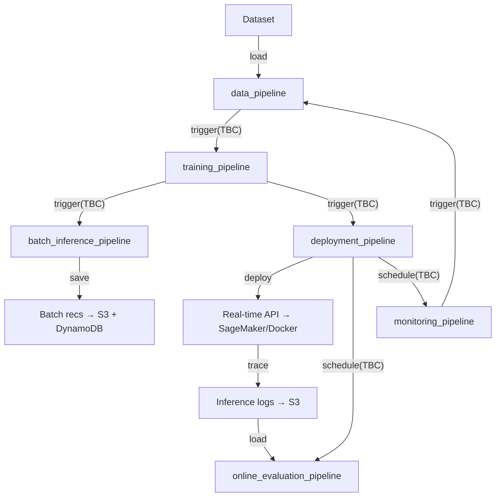

# ZenML MLOps Platform

End-to-end MLOps platform built on ZenML. Runs locally or on AWS with a single config switch.

## Architecture



_TBC: Means "to be confirmed" — the exact trigger/scheduling mechanism is not yet finalized due to the limitations in the community version of ZenML, but the intent is to have a fully automated workflow._

## Prerequisites

- [uv](https://docs.astral.sh/uv/) — Python version and package manager
- Docker (for serving + ZenML remote)
- AWS CLI configured (for AWS runs)

## Quick Start — Local Development

```bash
# 1. Install uv (if not already installed)
curl -LsSf https://astral.sh/uv/install.sh | sh

# 2. (First Time) Initialize local environment
make init

# 2.1 (Subsequent Runs) Start local environment
make up

# 3. List available workflows and pipelines
make list-workflows
make list-pipelines WORKFLOW=<workflow_name>

# 4. Run pipeline
make run-local-pipeline WORKFLOW=<workflow_name> PIPELINE=<pipeline_name>

```

To stop all local infra services:

```bash
docker compose down
# or
make down
```

## Docker files

All Docker assets live under the root `docker/` folder. Every build uses the repo root as context (`-f docker/<service>/Dockerfile .`):

```text
docker/
  pipeline/Dockerfile        # Shared base image for all ZenML pipeline steps
  serving/Dockerfile         # Shared FastAPI serving image (pass --build-arg WORKFLOW=<name>)
  zenml/Dockerfile
  ops-db/init.sh
docker-compose.yml
```

This structure is designed so each service image can be built and pushed to ECR independently, then mapped to separate ECS services/task definitions later.

## AWS Deployment

```bash
# 1. Set environment variables
export AWS_ACCOUNT_ID=123456789012
export AWS_REGION=us-east-1
export ZENML_ARTIFACT_BUCKET=zenml-artifacts
export ZENML_CHECKPOINT_BUCKET=zenml-checkpoints
export ZENML_DATA_BUCKET=zenml-data
export ZENML_PREDICTIONS_BUCKET=zenml-predictions
export ZENML_ECR_REPOSITORY=zenml
export ZENML_BATCH_DDB_TABLE_NAME=movie-recommendations
export ZENML_BATCH_DDB_PARTITION_KEY_NAME=id
export ZENML_AWS_CONNECTOR_NAME=aws_connector
export ZENML_EXEC_ROLE_NAME=zenml-execution-role
export ZENML_EXEC_ROLE_POLICY_NAME=zenml-execution-policy
export ZENML_SCHEDULER_ROLE_NAME=zenml-scheduler-role
export ZENML_SCHEDULER_ROLE_POLICY_NAME=zenml-scheduler-policy
export ZENML_SAGEMAKER_STEP_OPERATOR_NAME=sagemaker_step_operator
export ZENML_SAGEMAKER_STEP_OPERATOR_INSTANCE_TYPE=ml.m5.xlarge
# Optional: group step-operator jobs in a SageMaker experiment
export ZENML_SAGEMAKER_EXPERIMENT_NAME=zenml

# 2. Provision AWS infra + register AWS ZenML stack
#    (auto-creates zenml-execution-role using an inline policy generated from env vars)
make infra-aws

# 3. Switch to AWS stack
make stack-aws

# 4. Run full pipeline
make run-aws-training WORKFLOW=<workflow_name>
make run-aws-batch-inference WORKFLOW=<workflow_name>
make run-aws-deployment WORKFLOW=<workflow_name>
make run-aws-monitoring WORKFLOW=<workflow_name>
```

## Pipeline Reference

| Pipeline                            | Command                                                                   | Description                                                                 |
| ----------------------------------- | ------------------------------------------------------------------------- | --------------------------------------------------------------------------- |
| `<workflow_name>-data`              | `make run-local-pipeline WORKFLOW=<workflow_name> PIPELINE=data_pipeline` | Ingest → validate → encode → save features artifact                         |
| `<workflow_name>-training`          | `make run-local-training WORKFLOW=<workflow_name>`                        | Load features artifact → prepare features → optional HPO → train → register |
| `<workflow_name>-batch-inference`   | `make run-local-batch-inference WORKFLOW=<workflow_name>`                 | Batch recs fan-out/fan-in → S3 + DynamoDB                                   |
| `<workflow_name>-deployment`        | `make run-local-deployment WORKFLOW=<workflow_name>`                      | Build serving image → deploy real-time endpoint                             |
| `<workflow_name>-monitoring`        | `make run-local-monitoring WORKFLOW=<workflow_name>`                      | Ingest reference data → drift detection → retrain trigger                   |
| `<workflow_name>-online-evaluation` | `make run-local-online-evaluation WORKFLOW=<workflow_name>`               | Evaluate online ranking quality from inference logs                         |

## Configuration

All environment differences are controlled by config files — no code changes needed:

| Config Path                                                               | Scope                 | Example Values                                                                                                  |
| ------------------------------------------------------------------------- | --------------------- | --------------------------------------------------------------------------------------------------------------- |
| `workflows/<workflow_name>/configs/local/training_pipeline.yaml`          | Local training        | `dataset_size: "1m"`, `optuna_storage: ${OPS_DB_URI}/...`, `checkpoint_path: "s3://${ZENML_CHECKPOINT_BUCKET}"` |
| `workflows/<workflow_name>/configs/local/data_pipeline.yaml`              | Local data            | `dataset_size: "1m"`, validation thresholds, and encoder artifact creation                                      |
| `workflows/<workflow_name>/configs/local/batch_inference_pipeline.yaml`   | Local batch inference | `n_batches: 3`, `batch_output_path: "s3://${ZENML_PREDICTIONS_BUCKET}/batch"`, `model_stage: "staging"`         |
| `workflows/<workflow_name>/configs/local/deployment_pipeline.yaml`        | Local deployment      | `deploy_mode: "local"`, `endpoint_name: "<workflow_name>-endpoint"`                                             |
| `workflows/<workflow_name>/configs/local/monitoring_pipeline.yaml`        | Local monitoring      | `logs_path: "s3://${ZENML_PREDICTIONS_BUCKET}/logs"`, `retrain_config_path: .../local/training_pipeline.yaml`   |
| `workflows/<workflow_name>/configs/local/online_evaluation_pipeline.yaml` | Local online eval     | `logs_path: "s3://${ZENML_PREDICTIONS_BUCKET}/logs"`, `lookback_days: 30`                                       |
| `workflows/<workflow_name>/configs/aws/training_pipeline.yaml`            | AWS training          | `dataset_size: "25m"`, `checkpoint_path: "s3://..."`, `step_operator: true` on compute-heavy steps              |
| `workflows/<workflow_name>/configs/aws/data_pipeline.yaml`                | AWS data              | `dataset_size: "25m"`, validation thresholds, and encoder artifact creation                                     |
| `workflows/<workflow_name>/configs/aws/batch_inference_pipeline.yaml`     | AWS batch inference   | `n_batches: 17`, `dynamodb_table: "..."`, `step_operator: true` on batch generation                             |
| `workflows/<workflow_name>/configs/aws/deployment_pipeline.yaml`          | AWS deployment        | `deploy_mode: "sagemaker"`, `instance_type: "ml.t2.medium"`, `step_operator: true`                              |
| `workflows/<workflow_name>/configs/aws/monitoring_pipeline.yaml`          | AWS monitoring        | `logs_path: "s3://.../logs"`, `retrain_config_path: .../aws/training_pipeline.yaml`, `step_operator: true`      |
| `workflows/<workflow_name>/configs/aws/online_evaluation_pipeline.yaml`   | AWS online eval       | `logs_path: "s3://.../logs"`, `lookback_days: 30`, `step_operator: true`                                        |

## Adding a New Pipeline

See [AGENTS.md](AGENTS.md) and [.agents/skills/create-e2e-ml-workflow/SKILL.md](.agents/skills/create-e2e-ml-workflow/SKILL.md) for the full guide.

## Make Commands Reference

All commands are grouped to mirror the Makefile sections.

### Environment (.env)

| Command     | Description                                                                                     |
| ----------- | ----------------------------------------------------------------------------------------------- |
| `make .env` | Creates `.env` from `.env.example` only if `.env` is missing; leaves existing `.env` unchanged. |

### Environment Setup

| Command                      | Description                                                                                                                        |
| ---------------------------- | ---------------------------------------------------------------------------------------------------------------------------------- |
| `make sync`                  | Installs project dependencies with dev extras using `uv sync --extra dev`.                                                         |
| `make upgrade`               | Installs and upgrades project dependencies using `uv run python -m ensurepip --upgrade`.                                           |
| `make .venv`                 | Creates a virtual environment under `.venv` (usually invoked by `make sync`).                                                      |
| `make zenml-init`            | Initializes ZenML in the repo if `.zen` is not present.                                                                            |
| `make zenml-integrations`    | Installs ZenML integrations (`aws`, `s3`, `evidently`) via uv.                                                                     |
| `make zenml-connect`         | If `ZENML_STORE_API_KEY` is missing, skips login; otherwise runs `zenml login` against `ZENML_SERVER_URI`.                         |
| `make zenml-reconnect`       | Logs out and re-authenticates the local ZenML client against `ZENML_SERVER_URI`.                                                   |
| `make zenml-disconnect`      | Logs local ZenML client out of the connected ZenML server.                                                                         |
| `make zenml-default-project` | Sets the active ZenML project to `default`.                                                                                        |
| `make zenml-service-account` | Runs `infra/setup_service_account.sh` to create or rotate the ZenML service account API key.                                       |
| `make services-up`           | Starts docker-compose services in detached mode.                                                                                   |
| `make services-rebuild`      | Rebuilds and starts docker-compose services in detached mode.                                                                      |
| `make services-down`         | Stops and removes docker-compose services.                                                                                         |
| `make services-logs`         | Tails docker-compose logs for all services.                                                                                        |
| `make init`                  | First-time local bootstrap: create `.env` from `.env.example`, install deps, start services, register local stacks, connect ZenML. |
| `make up`                    | Subsequent local starts: ensure `.env` exists, start services, register local stacks, activate local stack, connect ZenML client.  |
| `make rebuild`               | Rebuild local services and re-run local stack setup + ZenML connection.                                                            |
| `make down`                  | Stops services and disconnects ZenML client.                                                                                       |

### Code Quality

| Command     | Description                                              |
| ----------- | -------------------------------------------------------- |
| `make lint` | Runs Ruff lint checks and formatting checks.             |
| `make fmt`  | Auto-fixes lint issues with Ruff and applies formatting. |

### Workflow Discovery

| Command                                        | Description                                                      |
| ---------------------------------------------- | ---------------------------------------------------------------- |
| `make list-workflows`                          | Lists all workflows discoverable by `run.py`.                    |
| `make list-pipelines WORKFLOW=<workflow_name>` | Lists pipelines available for a workflow.                        |
| `make validate-workflow-param`                 | Internal helper target that fails if `WORKFLOW` is not provided. |
| `make validate-pipeline-param`                 | Internal helper target that fails if `PIPELINE` is not provided. |

### Pipeline Runs (Local)

| Command                                                                     | Description                                                                                                                  |
| --------------------------------------------------------------------------- | ---------------------------------------------------------------------------------------------------------------------------- |
| `make run-local-data WORKFLOW=<workflow_name>`                              | Runs the workflow `data_pipeline` with `configs/local/data_pipeline.yaml` on `local_docker_stack`.                           |
| `make run-local-training WORKFLOW=<workflow_name>`                          | Runs the workflow `training_pipeline` with `configs/local/training_pipeline.yaml` on `local_docker_stack`.                   |
| `make run-local-batch-inference WORKFLOW=<workflow_name>`                   | Runs the workflow `batch_inference_pipeline` with `configs/local/batch_inference_pipeline.yaml` on `local_docker_stack`.     |
| `make run-local-deployment WORKFLOW=<workflow_name>`                        | Runs the workflow `deployment_pipeline` with `configs/local/deployment_pipeline.yaml` on `local_docker_stack`.               |
| `make run-local-monitoring WORKFLOW=<workflow_name>`                        | Runs the workflow `monitoring_pipeline` with `configs/local/monitoring_pipeline.yaml` on `local_docker_stack`.               |
| `make run-local-online-evaluation WORKFLOW=<workflow_name>`                 | Runs the workflow `online_evaluation_pipeline` with `configs/local/online_evaluation_pipeline.yaml` on `local_docker_stack`. |
| `make run-local-e2e WORKFLOW=<workflow_name>`                               | Runs all six local pipelines in order: data → training → batch-inference → deployment → monitoring → online-evaluation.      |
| `make run-local-pipeline WORKFLOW=<workflow_name> PIPELINE=<pipeline_name>` | Runs a selected pipeline with `configs/local/<pipeline_name>.yaml` on `local_docker_stack`.                                  |

### Pipeline Runs (AWS)

| Command                                                                   | Description                                                                                                       |
| ------------------------------------------------------------------------- | ----------------------------------------------------------------------------------------------------------------- |
| `make run-aws-data WORKFLOW=<workflow_name>`                              | Runs the workflow `data_pipeline` with `configs/aws/data_pipeline.yaml` on `aws_stack`.                           |
| `make run-aws-training WORKFLOW=<workflow_name>`                          | Runs the workflow `training_pipeline` with `configs/aws/training_pipeline.yaml` on `aws_stack`.                   |
| `make run-aws-batch-inference WORKFLOW=<workflow_name>`                   | Runs the workflow `batch_inference_pipeline` with `configs/aws/batch_inference_pipeline.yaml` on `aws_stack`.     |
| `make run-aws-deployment WORKFLOW=<workflow_name>`                        | Runs the workflow `deployment_pipeline` with `configs/aws/deployment_pipeline.yaml` on `aws_stack`.               |
| `make run-aws-monitoring WORKFLOW=<workflow_name>`                        | Runs the workflow `monitoring_pipeline` with `configs/aws/monitoring_pipeline.yaml` on `aws_stack`.               |
| `make run-aws-online-evaluation WORKFLOW=<workflow_name>`                 | Runs the workflow `online_evaluation_pipeline` with `configs/aws/online_evaluation_pipeline.yaml` on `aws_stack`. |
| `make run-aws-pipeline WORKFLOW=<workflow_name> PIPELINE=<pipeline_name>` | Runs a selected pipeline with `configs/aws/<pipeline_name>.yaml` on `aws_stack`.                                  |

### Infrastructure

| Command            | Description                                                                                                      |
| ------------------ | ---------------------------------------------------------------------------------------------------------------- |
| `make infra-local` | Registers/configures the local Docker ZenML stack (`local_docker_stack`) and SeaweedFS-backed S3 artifact store. |
| `make infra-aws`   | Registers/configures AWS ZenML stack components via script.                                                      |

### Stack Selection

| Command            | Description                                      |
| ------------------ | ------------------------------------------------ |
| `make stack-local` | Sets active ZenML stack to `local_docker_stack`. |
| `make stack-aws`   | Sets active ZenML stack to `aws_stack`.          |

### Cleanup

| Command          | Description                                                                                                                                                                         |
| ---------------- | ----------------------------------------------------------------------------------------------------------------------------------------------------------------------------------- |
| `make clean`     | Removes Python cache/build artifacts and local tool caches (`__pycache__`, `.pyc`, `dist`, `build`, `*.egg-info`, `.zen`, `.pytest_cache`, `.mypy_cache`, `.ruff_cache`, `.cache`). |
| `make clean-all` | Runs `clean`, prunes unused Docker resources (`docker system prune`, `docker volume prune`), then removes `.venv`.                                                                  |

## Resuming a Failed Training Run

Training checkpoints are saved after every epoch. If the job is interrupted, simply re-run the same command:

```bash
# Re-running after failure automatically resumes from the last completed epoch
make run-local-training WORKFLOW=<workflow_name>
```

Checkpoints are stored in `s3://${ZENML_CHECKPOINT_BUCKET}/<run_id>/` for both local (SeaweedFS) and AWS stacks.

## Key Design Decisions

| Decision              | Choice                                                   | Why                                                                              |
| --------------------- | -------------------------------------------------------- | -------------------------------------------------------------------------------- |
| **Workflow Monorepo** | All workflows live under `./workflows/`                  | Single repo for all workflows; no separate repos or ZenML stacks required        |
| **Checkpointing**     | Epoch-level `.npy` + `.done` marker                      | Atomic writes; resume from any epoch failure                                     |
| **HPO resumability**  | Optuna `load_if_exists=True` + SQLite/PG                 | Persists across restarts; no re-running completed trials                         |
| **Numba**             | `@njit(parallel=True, nogil=True)` on evaluation kernels | Fast RMSE + Precision/Recall/NDCG@K without NumPy overhead during training loops |
