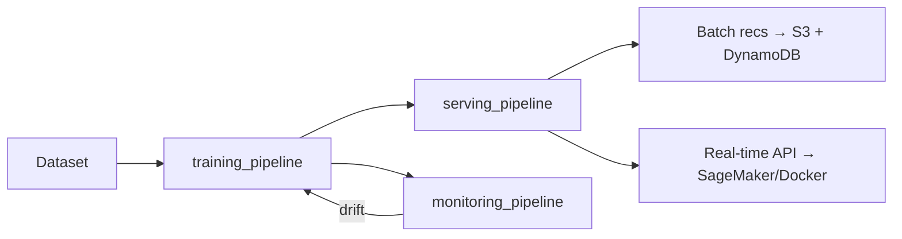

# AIPS Recommendations — ZenML MLOps Platform

End-to-end MLOps platform built on ZenML. Runs locally or on AWS with a single config switch.

## Architecture



## Prerequisites

- [uv](https://docs.astral.sh/uv/) — Python version and package manager
- Docker (for serving + ZenML remote)
- AWS CLI configured (for AWS runs)

## Quick Start — Local Development

```bash
# 1. Install uv (if not already installed)
curl -LsSf https://astral.sh/uv/install.sh | sh

# 2. Install dependencies and set up ZenML
make setup
# Equivalent to: uv sync --extra dev

# 3. Start local infra services (ZenML, MLflow, Evidently, Dask)
#    & Install dependencies and set up ZenML & Register / Activate local ZenML stack components
make up

# 4. List available workflows and pipelines
make list-workflows
make list-pipelines WORKFLOW=<workflow_name>

# 5. Run pipeline
make run-local-pipeline WORKFLOW=<workflow_name> PIPELINE=<pipeline_name>

```

To stop all local infra services:

```bash
docker compose down
# or
make down
```

## Docker files

All Docker assets live under the root `docker/` folder. Every build uses the repo root as context (`-f docker/<service>/Dockerfile .`):

```text
docker/
  pipeline/Dockerfile        # Shared base image for all ZenML pipeline steps
  serving/Dockerfile         # Shared FastAPI serving image (pass --build-arg WORKFLOW=<name>)
  zenml/Dockerfile
  mlflow/Dockerfile
  mlflow/start.sh
  evidently/Dockerfile
  evidently/start.sh
  dask/Dockerfile
  dask/start-scheduler.sh
  dask/start-worker.sh
docker-compose.yml
```

This structure is designed so each service image can be built and pushed to ECR independently, then mapped to separate ECS services/task definitions later.

## AWS Deployment

```bash
# 1. Set environment variables
export AWS_ACCOUNT_ID=123456789012
export AWS_REGION=us-east-1
export MLFLOW_TRACKING_URI=http://<your-ec2-ip>:5000
export MLFLOW_TRACKING_USERNAME=<username>
export MLFLOW_TRACKING_PASSWORD=<password>

# 2. Provision AWS infra + register AWS ZenML stack
#    (auto-creates zenml-execution-role from infra/aws/iam_policy.json if missing)
make infra-aws

# 3. Switch to AWS stack
make stack-aws

# 4. Run full pipeline
make run-aws-training WORKFLOW=<workflow_name>
make run-aws-serving WORKFLOW=<workflow_name>
make run-aws-monitoring WORKFLOW=<workflow_name>
```

## Pipeline Reference

| Pipeline                     | Command                                              | Description                                                                     |
| ---------------------------- | ---------------------------------------------------- | ------------------------------------------------------------------------------- |
| `<workflow_name>-training`   | `make run-local-training WORKFLOW=<workflow_name>`   | Ingest → validate → encode → split → optional HPO → train → evaluate → register |
| `<workflow_name>-serving`    | `make run-local-serving WORKFLOW=<workflow_name>`    | Batch recs + real-time endpoint                                                 |
| `<workflow_name>-monitoring` | `make run-local-monitoring WORKFLOW=<workflow_name>` | Ingest reference data → drift detection → retrain trigger                       |

## Configuration

All environment differences are controlled by config files — no code changes needed:

| Config                                         | Dask Partitions | HPO Storage | Checkpoint Path               |
| ---------------------------------------------- | --------------- | ----------- | ----------------------------- |
| `workflows/<workflow_name>/configs/local.yaml` | 4 (default)     | SQLite      | `./checkpoints`               |
| `workflows/<workflow_name>/configs/aws.yaml`   | 64 (default)    | PostgreSQL  | `s3://aips-zenml-checkpoints` |

## Adding a New Pipeline

See [AGENTS.md](AGENTS.md) and [.agents/skills/create-e2e-ml-workflow/SKILL.md](.agents/skills/create-e2e-ml-workflow/SKILL.md) for the full guide.

## Running Tests

```bash
make test              # unit tests only
make test-integration  # full pipeline integration tests
make test-all          # everything with coverage
```

## Resuming a Failed Training Run

Training checkpoints are saved after every epoch. If the job is interrupted, simply re-run the same command:

```bash
# Re-running after failure automatically resumes from the last completed epoch
make run-local-training WORKFLOW=<workflow_name>
```

Checkpoints are stored in `./checkpoints/<run_id>/` locally or `s3://aips-zenml-checkpoints/<run_id>/` on AWS.

## Key Design Decisions

| Decision                | Choice                                          | Why                                                      |
| ----------------------- | ----------------------------------------------- | -------------------------------------------------------- |
| **Algorithm**           | ALS (not SVD)                                   | Block-parallel, Dask-native, handles implicit feedback   |
| **Checkpointing**       | Epoch-level `.npy` + `.done` marker             | Atomic writes; resume from any epoch failure             |
| **HPO resumability**    | Optuna `load_if_exists=True` + SQLite/PG        | Persists across restarts; no re-running completed trials |
| **Distributed compute** | Dask `LocalCluster` / remote scheduler          | Same code runs locally and on AWS                        |
| **Numba**               | `@njit(parallel=True, nogil=True)` on ALS solve | 5–20× speedup on the per-user least-squares bottleneck   |
