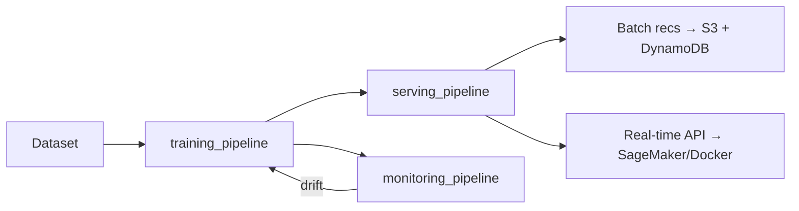

# ZenML MLOps Platform

End-to-end MLOps platform built on ZenML. Runs locally or on AWS with a single config switch.

## Architecture



## Prerequisites

- [uv](https://docs.astral.sh/uv/) — Python version and package manager
- Docker (for serving + ZenML remote)
- AWS CLI configured (for AWS runs)

## Quick Start — Local Development

```bash
# 1. Install uv (if not already installed)
curl -LsSf https://astral.sh/uv/install.sh | sh

# 2. (First Time) Initialize local environment
make init

# 2.1 (Subsequent Runs) Start local environment
make up

# 3. List available workflows and pipelines
make list-workflows
make list-pipelines WORKFLOW=<workflow_name>

# 4. Run pipeline
make run-local-pipeline WORKFLOW=<workflow_name> PIPELINE=<pipeline_name>

```

To stop all local infra services:

```bash
docker compose down
# or
make down
```

## Docker files

All Docker assets live under the root `docker/` folder. Every build uses the repo root as context (`-f docker/<service>/Dockerfile .`):

```text
docker/
  pipeline/Dockerfile        # Shared base image for all ZenML pipeline steps
  serving/Dockerfile         # Shared FastAPI serving image (pass --build-arg WORKFLOW=<name>)
  zenml/Dockerfile
  ops-db/init.sh
docker-compose.yml
```

This structure is designed so each service image can be built and pushed to ECR independently, then mapped to separate ECS services/task definitions later.

## AWS Deployment

```bash
# 1. Set environment variables
export AWS_ACCOUNT_ID=123456789012
export AWS_REGION=us-east-1
export ZENML_ARTIFACT_BUCKET=zenml-artifacts
export ZENML_CHECKPOINT_BUCKET=zenml-checkpoints
export ZENML_DATA_BUCKET=zenml-data
export ZENML_PREDICTIONS_BUCKET=zenml-predictions
export ZENML_ECR_REPOSITORY=zenml
export ZENML_BATCH_DDB_TABLE_NAME=movie-recommendations
export ZENML_BATCH_DDB_PARTITION_KEY_NAME=userId
export ZENML_AWS_CONNECTOR_NAME=aws_connector
export ZENML_EXEC_ROLE_NAME=zenml-execution-role
export ZENML_EXEC_ROLE_POLICY_NAME=zenml-execution-policy
export ZENML_SCHEDULER_ROLE_NAME=zenml-scheduler-role
export ZENML_SCHEDULER_ROLE_POLICY_NAME=zenml-scheduler-policy
export ZENML_SAGEMAKER_STEP_OPERATOR_NAME=sagemaker_step_operator
export ZENML_SAGEMAKER_STEP_OPERATOR_INSTANCE_TYPE=ml.m5.xlarge
# Optional: group step-operator jobs in a SageMaker experiment
export ZENML_SAGEMAKER_EXPERIMENT_NAME=zenml

# 2. Provision AWS infra + register AWS ZenML stack
#    (auto-creates zenml-execution-role using an inline policy generated from env vars)
make infra-aws

# 3. Switch to AWS stack
make stack-aws

# 4. Run full pipeline
make run-aws-training WORKFLOW=<workflow_name>
make run-aws-serving WORKFLOW=<workflow_name>
make run-aws-monitoring WORKFLOW=<workflow_name>
```

## Pipeline Reference

| Pipeline                     | Command                                              | Description                                                                     |
| ---------------------------- | ---------------------------------------------------- | ------------------------------------------------------------------------------- |
| `<workflow_name>-data`       | `make run-local-pipeline WORKFLOW=<workflow_name> PIPELINE=data_pipeline` | Ingest → validate → encode → save features artifact |
| `<workflow_name>-training`   | `make run-local-training WORKFLOW=<workflow_name>`   | Load features artifact + ingest → split → optional HPO → train → evaluate → register |
| `<workflow_name>-serving`    | `make run-local-serving WORKFLOW=<workflow_name>`    | Batch recs + real-time endpoint                                                 |
| `<workflow_name>-monitoring` | `make run-local-monitoring WORKFLOW=<workflow_name>` | Ingest reference data → drift detection → retrain trigger                       |

## Configuration

All environment differences are controlled by config files — no code changes needed:

| Config Path                                                        | Scope            | Example Values                                                                                                                       |
| ------------------------------------------------------------------ | ---------------- | ------------------------------------------------------------------------------------------------------------------------------------ |
| `workflows/<workflow_name>/configs/local/training_pipeline.yaml`   | Local training   | `dataset_size: "1m"`, `optuna_storage: ${OPS_DB_URI}/...`, `checkpoint_path: "s3://${ZENML_CHECKPOINT_BUCKET}"`                      |
| `workflows/<workflow_name>/configs/local/data_pipeline.yaml`       | Local data       | `dataset_size: "1m"`, validation thresholds, and encoder artifact creation                                        |
| `workflows/<workflow_name>/configs/local/serving_pipeline.yaml`    | Local serving    | `deploy_mode: "local"`, `batch_output_path: "s3://${ZENML_PREDICTIONS_BUCKET}/batch"`                                                |
| `workflows/<workflow_name>/configs/local/monitoring_pipeline.yaml` | Local monitoring | `logs_path: "s3://${ZENML_PREDICTIONS_BUCKET}/logs"`, `retrain_config_path: .../local/training_pipeline.yaml`                        |
| `workflows/<workflow_name>/configs/aws/training_pipeline.yaml`     | AWS training     | `dataset_size: "25m"`, `checkpoint_path: "s3://..."`, `step_operator: true` on compute-heavy steps                                   |
| `workflows/<workflow_name>/configs/aws/data_pipeline.yaml`         | AWS data         | `dataset_size: "25m"`, validation thresholds, and encoder artifact creation                                        |
| `workflows/<workflow_name>/configs/aws/serving_pipeline.yaml`      | AWS serving      | `deploy_mode: "sagemaker"`, `batch_output_path: "s3://${ZENML_PREDICTIONS_BUCKET}/batch"`, `step_operator: true` on batch generation |
| `workflows/<workflow_name>/configs/aws/monitoring_pipeline.yaml`   | AWS monitoring   | `logs_path: "s3://.../logs"`, `retrain_config_path: .../aws/training_pipeline.yaml`, `step_operator: true` on heavy steps            |

## Adding a New Pipeline

See [AGENTS.md](AGENTS.md) and [.agents/skills/create-e2e-ml-workflow/SKILL.md](.agents/skills/create-e2e-ml-workflow/SKILL.md) for the full guide.

## Make Commands Reference

All commands are grouped to mirror the Makefile sections.

### Environment (.env)

| Command          | Description                                                                                     |
| ---------------- | ----------------------------------------------------------------------------------------------- |
| `make env-setup` | Creates `.env` from `.env.example` only if `.env` is missing; leaves existing `.env` unchanged. |

### Environment Setup

| Command                   | Description                                                                                                                          |
| ------------------------- | ------------------------------------------------------------------------------------------------------------------------------------ |
| `make setup`              | Full local setup: creates virtual env dependencies, ensures `.env` exists, initializes ZenML, and installs ZenML integrations.       |
| `make .venv`              | Installs project dependencies with dev extras using `uv sync --extra dev` (usually invoked by `make setup`).                         |
| `make zenml-init`         | Initializes ZenML in the repo if `.zen` is not present.                                                                              |
| `make zenml-integrations` | Installs ZenML integrations (`aws`, `s3`, `evidently`) via uv.                                                             |
| `make zenml-connect`      | If `ZENML_STORE_API_KEY` is set, uses env-based auth and skips login; otherwise runs `zenml login` against `ZENML_SERVER_URI`.       |
| `make zenml-disconnect`   | Logs local ZenML client out of the connected ZenML server.                                                                           |
| `make services-up`        | Starts docker-compose services in detached mode.                                                                                     |
| `make services-rebuild`   | Rebuilds and starts docker-compose services in detached mode.                                                                        |
| `make services-down`      | Stops and removes docker-compose services.                                                                                           |
| `make services-logs`      | Tails docker-compose logs for all services.                                                                                          |
| `make up`                 | End-to-end local bootstrap: ensure `.env` exists, start services, register local stacks, activate local stack, connect ZenML client. |
| `make rebuild`            | Rebuild local services and re-run local stack setup + ZenML connection.                                                              |
| `make down`               | Stops services and disconnects ZenML client.                                                                                         |

### Code Quality

| Command     | Description                                              |
| ----------- | -------------------------------------------------------- |
| `make lint` | Runs Ruff lint checks and formatting checks.             |
| `make fmt`  | Auto-fixes lint issues with Ruff and applies formatting. |

### Workflow Discovery

| Command                                        | Description                                                      |
| ---------------------------------------------- | ---------------------------------------------------------------- |
| `make list-workflows`                          | Lists all workflows discoverable by `run.py`.                    |
| `make list-pipelines WORKFLOW=<workflow_name>` | Lists pipelines available for a workflow.                        |
| `make validate-workflow-param`                 | Internal helper target that fails if `WORKFLOW` is not provided. |
| `make validate-pipeline-param`                 | Internal helper target that fails if `PIPELINE` is not provided. |

### Pipeline Runs (Local)

| Command                                                                     | Description                                                                                                    |
| --------------------------------------------------------------------------- | -------------------------------------------------------------------------------------------------------------- |
| `make run-local-training WORKFLOW=<workflow_name>`                          | Runs the workflow `training_pipeline` with `configs/local/training_pipeline.yaml` on `local_docker_stack`.     |
| `make run-local-serving WORKFLOW=<workflow_name>`                           | Runs the workflow `serving_pipeline` with `configs/local/serving_pipeline.yaml` on `local_docker_stack`.       |
| `make run-local-monitoring WORKFLOW=<workflow_name>`                        | Runs the workflow `monitoring_pipeline` with `configs/local/monitoring_pipeline.yaml` on `local_docker_stack`. |
| `make run-local-pipeline WORKFLOW=<workflow_name> PIPELINE=<pipeline_name>` | Runs a selected pipeline with `configs/local/<pipeline_name>.yaml` on `local_docker_stack`.                    |

### Pipeline Runs (AWS)

| Command                                                                   | Description                                                                                         |
| ------------------------------------------------------------------------- | --------------------------------------------------------------------------------------------------- |
| `make run-aws-training WORKFLOW=<workflow_name>`                          | Runs the workflow `training_pipeline` with `configs/aws/training_pipeline.yaml` on `aws_stack`.     |
| `make run-aws-serving WORKFLOW=<workflow_name>`                           | Runs the workflow `serving_pipeline` with `configs/aws/serving_pipeline.yaml` on `aws_stack`.       |
| `make run-aws-monitoring WORKFLOW=<workflow_name>`                        | Runs the workflow `monitoring_pipeline` with `configs/aws/monitoring_pipeline.yaml` on `aws_stack`. |
| `make run-aws-pipeline WORKFLOW=<workflow_name> PIPELINE=<pipeline_name>` | Runs a selected pipeline with `configs/aws/<pipeline_name>.yaml` on `aws_stack`.                    |

### Infrastructure

| Command            | Description                                                                                                      |
| ------------------ | ---------------------------------------------------------------------------------------------------------------- |
| `make infra-local` | Registers/configures the local Docker ZenML stack (`local_docker_stack`) and SeaweedFS-backed S3 artifact store. |
| `make infra-aws`   | Registers/configures AWS ZenML stack components via script.                                                      |

### Stack Selection

| Command            | Description                                      |
| ------------------ | ------------------------------------------------ |
| `make stack-local` | Sets active ZenML stack to `local_docker_stack`. |
| `make stack-aws`   | Sets active ZenML stack to `aws_stack`.          |

### Cleanup

| Command                  | Description                                                                                  |
| ------------------------ | -------------------------------------------------------------------------------------------- |
| `make clean`             | Removes Python cache/build artifacts (`__pycache__`, `.pyc`, `dist`, `build`, `*.egg-info`). |
| `make clean-checkpoints` | Removes local checkpoint directory.                                                          |
| `make clean-all`         | Runs `clean` and `clean-checkpoints`, then removes `.venv`.                                  |

## Resuming a Failed Training Run

Training checkpoints are saved after every epoch. If the job is interrupted, simply re-run the same command:

```bash
# Re-running after failure automatically resumes from the last completed epoch
make run-local-training WORKFLOW=<workflow_name>
```

Checkpoints are stored in `s3://${ZENML_CHECKPOINT_BUCKET}/<run_id>/` for both local (SeaweedFS) and AWS stacks.

## Key Design Decisions

| Decision                | Choice                                          | Why                                                      |
| ----------------------- | ----------------------------------------------- | -------------------------------------------------------- |
| **Algorithm**           | ALS (not SVD)                                   | Block-parallel, handles implicit feedback                |
| **Checkpointing**       | Epoch-level `.npy` + `.done` marker             | Atomic writes; resume from any epoch failure             |
| **HPO resumability**    | Optuna `load_if_exists=True` + SQLite/PG        | Persists across restarts; no re-running completed trials |
| **Distributed compute** | ProcessPoolExecutor + Numba                     | Efficient CPU-bound ALS updates with parallel partitions |
| **Numba**               | `@njit(parallel=True, nogil=True)` on ALS solve | 5–20× speedup on the per-user least-squares bottleneck   |
