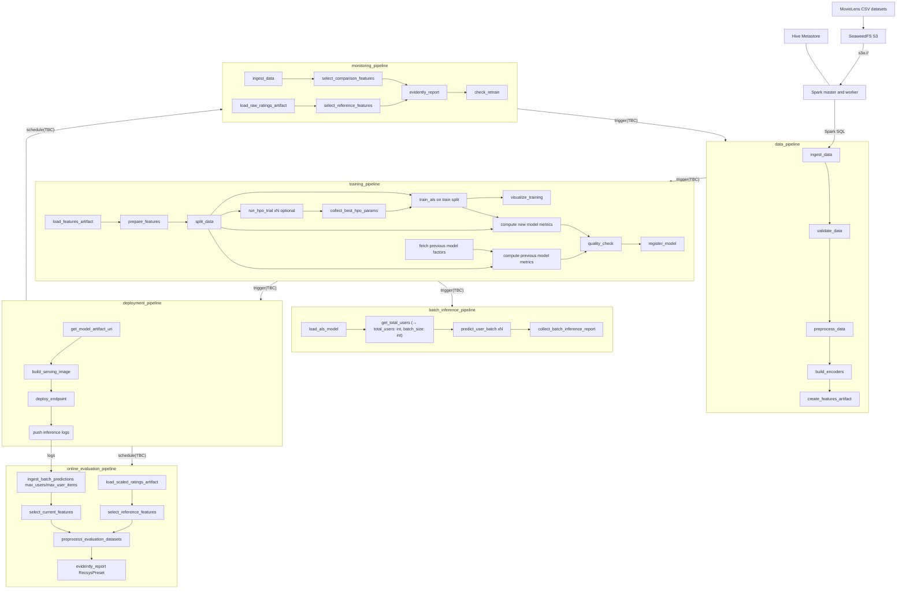

# Workflow: Matrix Factorization

## Confirmed Decisions

| Decision                | Choice                                                                               | Rationale                                                                  |
| ----------------------- | ------------------------------------------------------------------------------------ | -------------------------------------------------------------------------- |
| **Algorithm**           | **ALS** (not SVD)                                                                    | Handles implicit feedback and supports BLAS-backed training via `implicit` |
| **ZenML Server**        | Local compose stack (dev) and remote AWS stack (prod)                                | Shared metadata store + dashboard across environments                      |
| **Serving**             | Both batch (S3 + optional DynamoDB) and real-time (FastAPI + local/SageMaker deploy) | Batch for pre-computation; real-time for low-latency fallback              |
| **Dataset**             | MovieLens Hive tables (`ml_ratings_1m`, `ml_ratings_10m`, `ml_ratings_25m`)           | SeaweedFS S3-backed tables are queried through Spark SQL and Hive Metastore |
| **Monitoring**          | Evidently AI                                                                         | Purpose-built ML monitoring with ZenML-compatible workflow                 |
| **Experiment tracking** | ZenML native (log_metadata)                                                          | Built-in metadata logging without external dependency                      |
| **Checkpointing**       | Epoch-level `.npy` + `.done` marker files                                            | Resumable training with atomic checkpoint commits                          |
| **ALS backend**         | `implicit.als.AlternatingLeastSquares` (default)                                     | BLAS-backed, GPU-optional; handles all parallelism internally              |
| **Pluggable model**     | `recommender_class_name` config param (any `BaseRecommender`)                        | Swap ALS backends or algorithms without touching pipeline code             |

---

## Architecture Overview

_TBC: Means "to be confirmed" — the exact trigger/scheduling mechanism is not yet finalized due to the limitations in the community version of Zenml, but the intent is to have a fully automated workflow._

---

## Source Layout (Current)

- `workflows/matrix_factorization/configs/local/{data_pipeline,training_pipeline,batch_inference_pipeline,deployment_pipeline,monitoring_pipeline,online_evaluation_pipeline}.yaml`
- `workflows/matrix_factorization/configs/aws/{data_pipeline,training_pipeline,batch_inference_pipeline,deployment_pipeline,monitoring_pipeline,online_evaluation_pipeline}.yaml`
- `workflows/matrix_factorization/materializers/als_recommender_materializer.py`
- `workflows/matrix_factorization/models/{als_implicit_recommender,als_numba_recommender,base_recommender,numba}.py`
- `workflows/matrix_factorization/pipelines/{data,training,batch_inference,deployment,monitoring,online_evaluation}_pipeline.py`
- `workflows/matrix_factorization/steps/`
  - `data/ingest.py`, `data/validate.py`, `data/preprocess.py`
  - `features/{encoders,artifacts,select,split}.py` (`split.py` exports `prepare_features` + `split_data`)
  - `hpo/run_hpo.py` (`run_hpo_trial`, `collect_best_hpo_params`)
    - `training/train_als.py` (`train_als` — train-split loop with inline checkpoint resume and optional warm start)
    - `evaluation/evaluate.py` (`fetch_previous_model_factors`, `compute_metrics`, `quality_check`)
    - `evaluation/register.py` (`register_model`)
  - `prediction/{batch_predict,batch_predict_user}.py`
  - `data/preprocess.py` also exports `preprocess_evaluation_datasets` (aligns/caps reference vs. current datasets for online evaluation)
- `workflows/matrix_factorization/serving/app.py`
- shared helpers: `helpers/checkpointing.py`, `helpers/resource_monitor.py` (per-epoch CPU/memory/GPU snapshots), `helpers/pipeline.py` (pipeline trigger + discovery)
- shared retrain/trigger helpers: `steps/retrain.py`, `steps/trigger.py`
- shared serving steps: `steps/serving/{build_image,deploy_model,model_artifacts}.py`

---

## Pipeline Definitions

### Training pipeline (`training_pipeline`)

Order:

1. `load_features_artifact`
2. `prepare_features` (applies encoders to full dataset; always run before training)
3. `split_data` (shared temporal train/evaluation split)
4. `run_hpo_trial` (fan-out, optional via `enable_hpo`)
5. `collect_best_hpo_params` (fan-in, optional via `enable_hpo`)
6. `train_als` (trains on the training split with inline checkpoint resume; supports warm start from a previous model stage)
7. `visualize_training`
8. `fetch_previous_model_factors`
9. `compute_metrics` for the candidate and previous model on the same evaluation split
10. `quality_check` (absolute thresholds plus per-metric regression checks)
11. `register_model` (promotes only when `quality_check` passes)

### Data pipeline (`data_pipeline`)

Order:

1. `ingest_data`
2. `validate_data`
3. `preprocess_data` (dedup, user/item activity filter, top-N per user)
4. `build_encoders`
5. `create_features_artifact`

Bound ZenML model: `als_movie_recommender`.

### Batch inference pipeline (`batch_inference_pipeline`)

Runs batch scoring fan-out/fan-in:

- `load_als_model` → `get_total_users` (→ `total_users: int`, `batch_size: int`) → `predict_user_batch` × n_batches (fan-out, each computes its own slice) → `collect_batch_inference_report` (fan-in)

Outputs to S3 parquet and optionally DynamoDB.

### Deployment pipeline (`deployment_pipeline`)

Builds and deploys the real-time serving endpoint:

- `get_model_artifact_uri` → `build_serving_image` → `deploy_endpoint`

### Monitoring pipeline (`monitoring_pipeline`)

Order:

1. `load_raw_ratings_artifact` → `select_feature_columns(id="select_reference_features")` (training baseline)
2. `ingest_data` → `select_feature_columns(id="select_comparison_features")` (new/recent data)
3. `evidently_report` (single report, `DataQualityPreset` + `DataDriftPreset`)
4. `check_retrain` (evaluates the report; emits `should_retrain`)

Retrain target:

- module: `workflows.matrix_factorization.pipelines.training_pipeline`
- function: `training_pipeline`

### Online evaluation pipeline (`online_evaluation_pipeline`)

Order:

1. `load_scaled_ratings_artifact` → `select_feature_columns(id="select_reference_features")` (ground-truth training ratings)
2. `ingest_batch_predictions(max_users, max_user_items, limit=max_users*max_user_items)` → `select_feature_columns(id="select_current_features")` (recent model predictions; use `ingest_prediction_logs` instead for real-time serving logs)
3. `preprocess_evaluation_datasets` (aligns reference users to current users; caps top ratings per user to `max_user_items`)
4. `evidently_report` (Evidently `RecsysPreset` at `k=top_k`)

Observability only — no retrain trigger.

---

## Configuration Contract

### `configs/local/training_pipeline.yaml`

Core values:

- `enable_hpo: false`
- `optuna_storage: "${OPTUNA_STORAGE_URI}"`
- `checkpoint_path: "s3://${ZENML_CHECKPOINT_BUCKET}"`
- `split_data.parameters.train_ratio: 0.8`
- quality thresholds and `force_promote` are configured under `quality_check`
- `settings.docker.dockerfile: "docker/pipeline/Dockerfile"`

### `configs/local/data_pipeline.yaml`

Core values:

- `dataset_table: "ml_ratings_1m"`
- `lookback_days` selects `eventDate` partitions relative to the table's latest partition
- `spark_master_url: "spark://spark-master:7077"`
- Hive tables resolve MovieLens files from `s3a://zenml-data/movielens/` through SeaweedFS
- validation thresholds for sparse ratings data
- `create_features_artifact` persists encoder artifact

### `configs/local/batch_inference_pipeline.yaml`

Core values:

- `n_batches: 3`
- `model_stage: "staging"`
- `batch_output_path: "s3://${ZENML_PREDICTIONS_BUCKET}/batch"`

### `configs/local/deployment_pipeline.yaml`

Core values:

- `deploy_mode: "local"`
- `endpoint_name: "als-movie-recommender"`

### `configs/local/monitoring_pipeline.yaml`

Core values:

- `logs_path: "s3://${ZENML_PREDICTIONS_BUCKET}/logs"`
- `monitoring_output_path: "s3://${ZENML_PREDICTIONS_BUCKET}/monitoring"`
- `retrain_config_path: "workflows/matrix_factorization/configs/local/training_pipeline.yaml"`

### `configs/local/online_evaluation_pipeline.yaml`

Core values:

- pipeline `parameters`: `top_k: 10`, `max_users: 1000`, `max_user_items: 20`
- `ingest_batch_predictions.parameters.logs_path`/`batch_output_path`: `"s3://${ZENML_PREDICTIONS_BUCKET}/..."`
- `lookback_days: 30`

### `configs/aws/training_pipeline.yaml`

Core values:

- `enable_hpo: false`
- `optuna_storage: "${OPTUNA_STORAGE_URI}"`
- `checkpoint_path: "s3://${ZENML_CHECKPOINT_BUCKET}"`
- `split_data.parameters.train_ratio: 0.9`
- quality thresholds and `force_promote` are configured under `quality_check`

### `configs/aws/data_pipeline.yaml`

Core values:

- `dataset_table: "ml_ratings_25m"`
- `lookback_days` selects `eventDate` partitions relative to the table's latest partition
- `spark_master_url: "${SPARK_MASTER_URL}"`
- Hive tables should reference the production object store through the configured S3A filesystem
- validation thresholds for sparse ratings data
- `create_features_artifact` persists encoder artifact

### `configs/aws/batch_inference_pipeline.yaml`

Core values:

- `n_batches: 17`
- `batch_output_path: "s3://zenml-predictions/batch"`
- `dynamodb_table: "${ZENML_BATCH_DDB_TABLE_NAME}"`

### `configs/aws/deployment_pipeline.yaml`

Core values:

- `deploy_mode: "sagemaker"`
- `instance_type: "ml.t2.medium"`

### `configs/aws/monitoring_pipeline.yaml`

Core values:

- `monitoring_output_path: "s3://zenml-predictions/monitoring"`
- `retrain_config_path: "workflows/matrix_factorization/configs/aws/training_pipeline.yaml"`
- `settings.docker.dockerfile: "docker/pipeline/Dockerfile"`

### `configs/aws/online_evaluation_pipeline.yaml`

Core values:

- pipeline `parameters`: `top_k: 10`, `max_users: 10000`, `max_user_items: 10`
- `ingest_batch_predictions.parameters.logs_path`/`batch_output_path`: `"s3://${ZENML_PREDICTIONS_BUCKET}/..."`
- `lookback_days: 30`

---

## Serving API Contract (`serving/app.py`)

Endpoints:

- `GET /health` -> `{status, app_version, model_version, n_users, n_items, factors, cpu_percent, memory_percent, disk_percent}`
- `POST /predict` with `{user_id, top_k}` -> `{user_id, predictions, model_version, latency_ms}`

Behavior:

- Resolves `MODEL_URI` to `MODEL_PATH` on startup; `MODEL_URI` may be local or `s3://...`.
- Writes inference logs to `MODEL_INFERENCE_LOG_PATH` when `MODEL_INFERENCE_LOG_ENABLED=true`.
- Returns 404 for unknown users.

---

## AWS Stack Components (from `infra/aws/setup_stacks.sh`)

| Component          | Name                       |
| ------------------ | -------------------------- |
| Service Connector  | `aws_connector`            |
| Artifact Store     | `s3_store`                 |
| Container Registry | `ecr_registry`             |
| Orchestrator       | `sagemaker_orchestrator`   |
| Step Operator      | `sagemaker_step_operator`  |
| Image Builder      | `local_image_builder`      |
| Data Validator     | `evidently_data_validator` |
| Stack              | `aws_stack`                |

---
